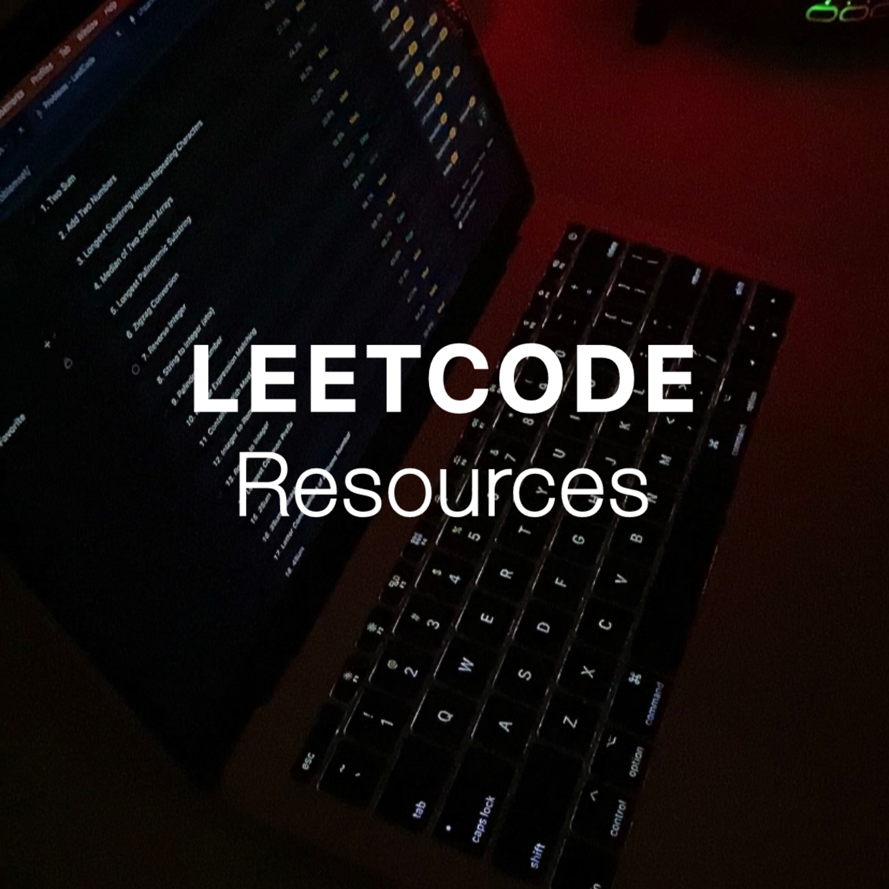

  

# Leetcode Resources & Practice

This repo contains trusted resources to practice Leetcode, as well as my personal notes + practice exercises.

# How I use the resources

1. Pick language (in my case Python)
2. If not familiar, **learn basics**: array, lists, hashmaps, trees, sorting, binary search _(Check Pre-Leetcode Folder)_. If not familiar start learning **Big O notation**.
3. Follow **Roadmap** in order (ie. neetcode's)
4. Solve each problem in **25-30 min** (Using Leetcode Timer extension). Just as important, **revisit Big-O**, understand the efficiency of operations for **all** problems.
    > if stuck after 15 min, peek at hints/solutions
    > if unable to understand solution after drawing it, pick an easier problem
    
    4.1  While understanding concepts or solutions, use **supportive material**: books, yt  playlists, and visualization tool for algorithms. As getting more confortable in problem solving, use **pattern resources**.
5. Key: **review & redo** problems after a few days (spaced repetition). And keep a **Big O cheat sheet** handy.

## 💡 Start Here

- [How to start Leetcode](https://blog.algomaster.io/p/how-to-start-leetcode-in-2025)
- [How I Mastered DSA](https://blog.algomaster.io/p/how-i-mastered-data-structures-and-algorithms)
- [15 LeetCode Patterns](https://blog.algomaster.io/p/15-leetcode-patterns)

## ⏳ LeetCode timer

- [Chrome Extension](https://chromewebstore.google.com/detail/leetcode-timer/gfkgelnlcnomnahkfmhemgpahgmibofd) to time leetcode problem solving.

## 📍 Roadmaps

- [roadmap.sh](https://roadmap.sh/datastructures-and-algorithms)
- [Neetcode.io Roadmap](https://neetcode.io/roadmap)

## 🚀 Curated Problems

- [Blind 75](https://leetcode.com/discuss/post/460599/blind-75-leetcode-questions-by-krishnade-9xev/) 
- [Top Interview 150](https://leetcode.com/studyplan/top-interview-150/)
- [Blind 75](https://neetcode.io/practice?tab=blind75) Neetcode's version. 
- [Neetcode 150](https://neetcode.io/practice?tab=neetcode150) 150 is the 'Blind 75' + 75 more problems. For people **already familiar** with basic algorithms & data structures.
- [Neetcode 250](https://neetcode.io/practice?tab=neetcode250) 150 + 100 more problems. Neetcodes most **beginner** friendly list.

## 🚀 Patterns

- [15 LeetCode Patterns](https://blog.algomaster.io/p/15-leetcode-patterns)
- [Two Pointers Patterns](https://www.youtube.com/watch?v=QzZ7nmouLTI)
- [Heap Patterns](https://leetcode.com/discuss/post/1127238/master-heap-understanding-4-patterns-whe-fb8z/)
- [20 Dynamic Programming Patterns](https://blog.algomaster.io/p/20-patterns-to-master-dynamic-programming)
- [DP Patterns](https://leetcode.com/discuss/post/458695/Dynamic-Programming-Patterns/)
- [Tree Patterns](https://leetcode.com/discuss/post/937307/iterative-recursive-dfs-bfs-tree-travers-e1f4/)
- [Linked Lists in-place reversal Pattern](https://leetcode.com/discuss/post/937307/iterative-recursive-dfs-bfs-tree-travers-e1f4/)
- [DFS + BFS Patterns (1)](https://medium.com/leetcode-patterns/leetcode-pattern-1-bfs-dfs-25-of-the-problems-part-1-519450a84353)
- [DFS + BFS Patterns (2)](https://medium.com/leetcode-patterns/leetcode-pattern-2-dfs-bfs-25-of-the-problems-part-2-a5b269597f52)

## 📺 Youtube Playlists

- [Blind 75 - Neetcode Playlist](https://www.youtube.com/watch?v=KLlXCFG5TnA&list=PLot-Xpze53ldVwtstag2TL4HQhAnC8ATf) Solutions + explained problem solving.
- [AlgoMaster](https://www.youtube.com/playlist?list=PLK63NuByH5o-tqaMUHRA4r8ObRW7PWz45) Leetcode Patterns.
- [Abdul Bari's](https://www.youtube.com/playlist?list=PLDN4rrl48XKpZkf03iYFl-O29szjTrs_O) Algorithms.
- William Fiset's [DSA](https://www.youtube.com/playlist?list=PLDV1Zeh2NRsB6SWUrDFW2RmDotAfPbeHu) playlist and [Graphs](https://www.youtube.com/playlist?list=PLDV1Zeh2NRsDGO4--qE8yH72HFL1Km93P) playlist.

## 🖼️📚 Visualization & Books

- [VisuAlgo](https://visualgo.net/en) watch problems come to life.
- [Data Structures & Algorithms Made Easy](https://www.amazon.in/dp/B08CMLS7LZ)
